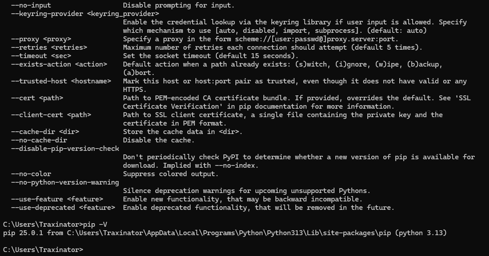
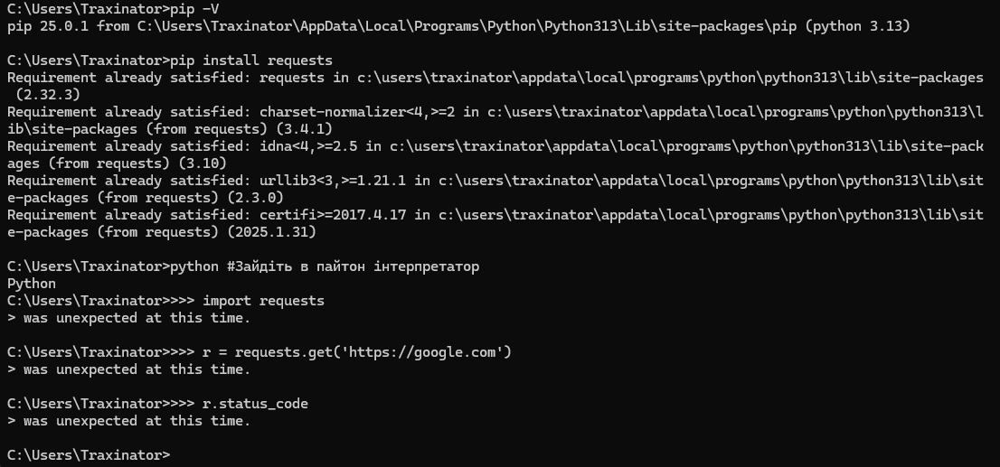
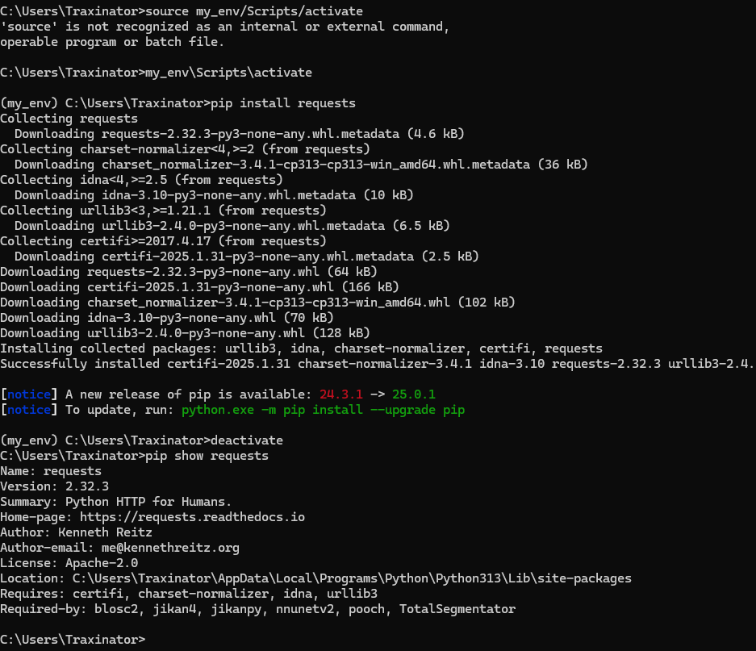
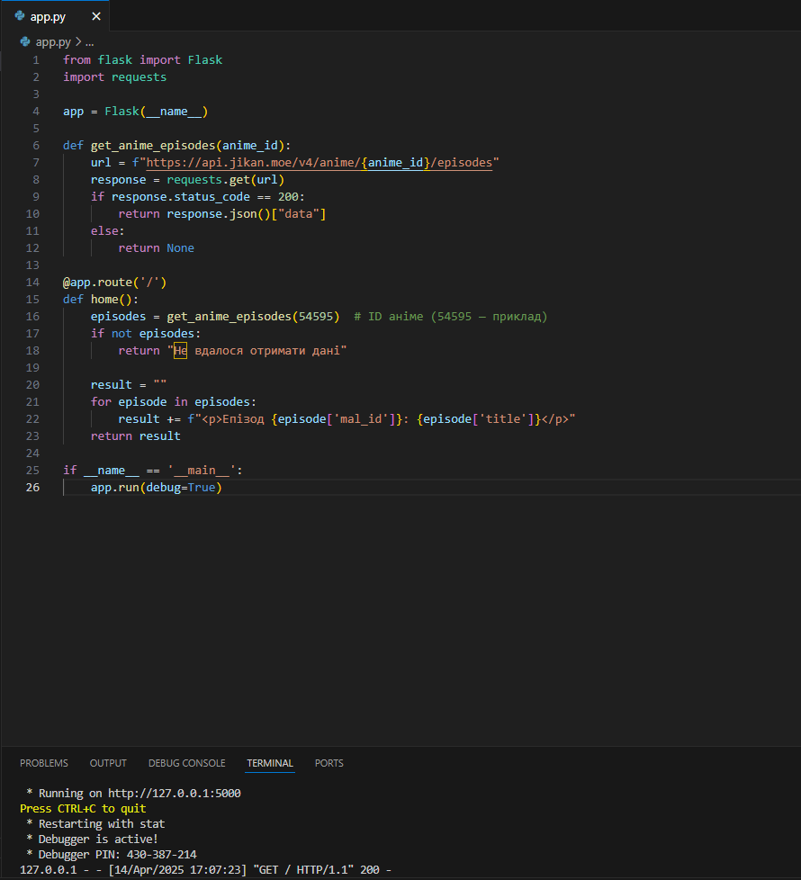
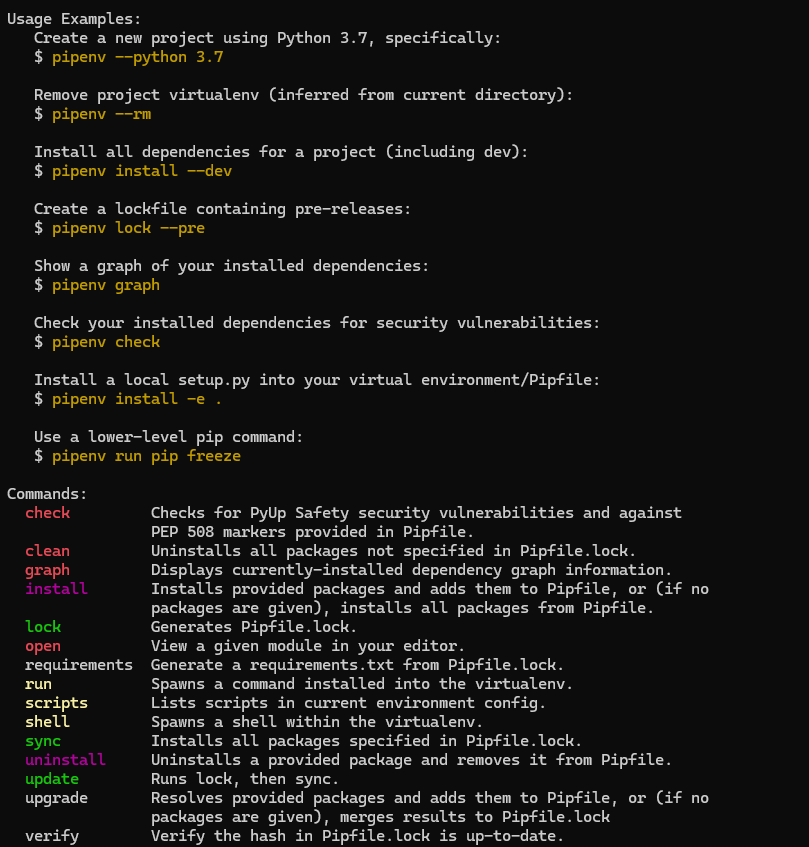
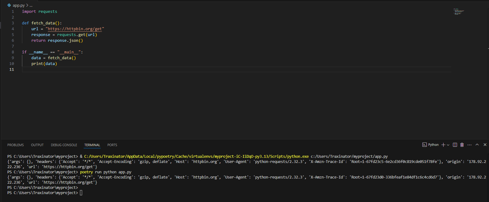
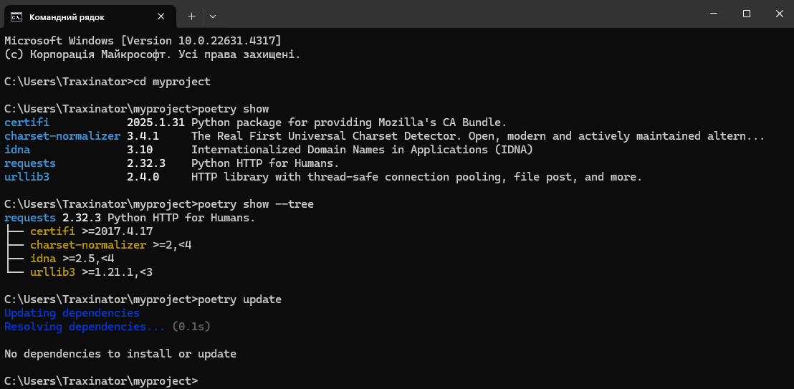
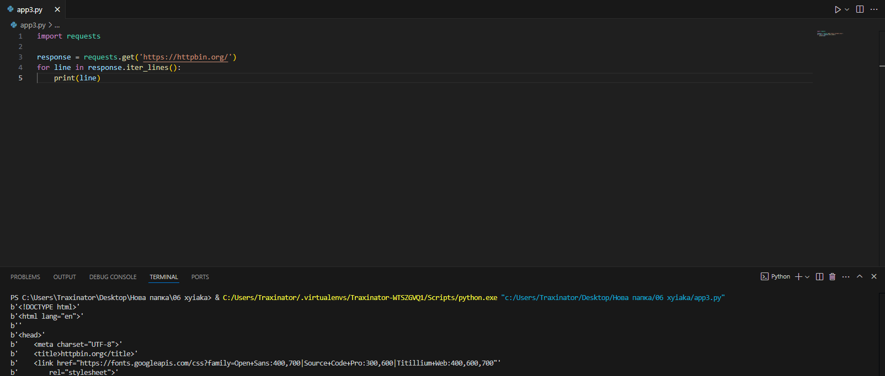
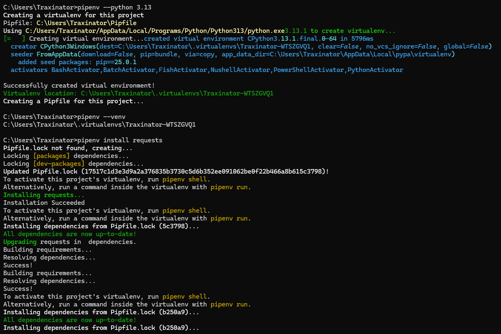

# Звіт до роботи

**Тема:** Робота зі сторонніми бібліотеками та віртуальними середовищами в Python  
**Мета роботи:** Навчитися встановлювати та використовувати сторонні бібліотеки, працювати з віртуальними середовищами (VENV, Pipenv, Poetry) та експериментувати з API для отримання даних.

---

## Виконання роботи

### Завдання 1: Робота з PIP та бібліотекою `requests`
1. **Перевірка PIP:**
   - Виконано команду `pip -V`, яка показала версію PIP та шлях до інсталяції:
     ```
     pip 25.0.1 from C:\Users\Traxinator\AppData\Local\Programs\Python\Python313\Lib\site-packages\pip (python 3.13)
     ```
   - Команда `pip --help` вивела список доступних опцій для роботи з PIP (див. Screenshot_1.png).

2. **Встановлення бібліотеки `requests`:**
   - Виконано команду `pip install requests`. Бібліотека вже була встановлена:
     ```
     Requirement already satisfied: requests in c:\users\traxinator\appdata\local\programs\python\python313\Lib\site-packages (2.32.3)
     ```
   - Спробу використання бібліотеки в інтерпретаторі Python (див. Screenshot_3.png) завершилися помилкою через неправильний ввід команд.

3. **Робота з методами `requests`:**
   - Використано метод `iter_lines()` для читання відповіді з `https://httpbin.org/` (див. app3.py).

4. **Оновлення та видалення бібліотеки:**
   - Виконано команди `pip show requests`, `pip install requests==2.1`, `pip uninstall requests` (результати у Screenshot_6.png).

### Завдання 2: Робота з бібліотекою `jikanpy`
1. **Запуск програми для отримання даних про аніме:**
   - Використано код з `app.py` для отримання списку епізодів аніме (ID 54595). Програма вивела список епізодів у браузері (див. Screenshot_5.png).


### Завдання 3: Робота з віртуальним середовищем (VENV)
1. **Створення та активація VENV:**
   - Виконано команди:
     ```
     python -m venv ./my_env
     my_env\Scripts\activate
     pip install requests
     deactivate
     ```
   - Після деактивації середовища команда `pip show requests` показала глобальну інсталяцію бібліотеки (див. Screenshot_7.png).

### Завдання 4: Робота з Pipenv
1. **Інсталяція Pipenv та створення середовища:**
   - Виконано команди:
     ```
     pip install pipenv
     pipenv --python 3.10
     pipenv install requests
     ```
   - Створено файли `Pipfile` та `Pipfile.lock` з описом залежностей.
   - Запущено програму `app3.py` через `pipenv run python app3.py` (результати у Screenshot_9.png).

### Завдання 5: Робота зі змінними середовища
1. **Виконання коду з файлом `.env`:**
   - Створено файл `.env` зі змінною `HELLO`. Код `example.env.py` викликає помилку, якщо змінна не встановлена (див. example.env.py).

### Завдання 6: Робота з Poetry
1. **Інсталяція Poetry та створення проекту:**
   - Виконано команди:
     ```
     poetry new myproject
     poetry add requests
     poetry show --tree
     ```
   - Створено файли `pyproject.toml` та `poetry.lock`.

2. **Запуск програми у віртуальному середовищі:**
   - Використано AI для створення програми на Flask (код у `app.py`). Запущено через `poetry run python app.py`.



---

## Висновок

❓ **Що зроблено в роботі:**  
- Встановлено та використано бібліотеки `requests` та `jikanpy`.  
- Працював з віртуальними середовищами (VENV, Pipenv, Poetry).  
- Створено та запущено програми для роботи з API.  

❓ **Чи досягнуто мети роботи:**  
Так, мета досягнута: навчився керувати бібліотеками та середовищами.  

❓ **Які нові знання отримано:**  
- Робота з Pipenv та Poetry.  
- Використання змінних середовища.  

❓ **Чи вдалось відповісти на всі питання:**  
Так, всі питання розглянуто.  

❓ **Чи виникли складності:**  
Так, помилки під час роботи з інтерпретатором Python (див. Screenshot_3.png).  

❓ **Формат здачі:**  
Подобається, але бажано більше структурованих інструкцій.  

❓ **Побажання:**  
Додати приклади для складніших сценаріїв.  

--- 

**Додатки:**  
- Усі скріншоти та файли знаходяться у репозиторії.  
